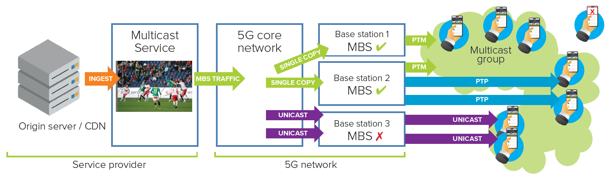
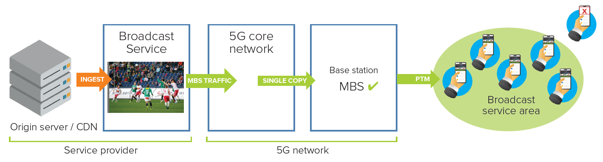
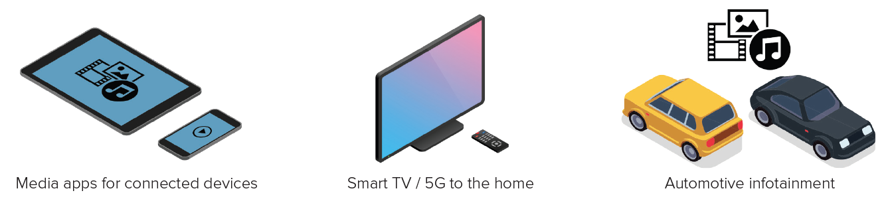

:::warning
This documentation is currently **under development and subject to change**. If you are interested in becoming a member of the 5G-MAG and actively participating in shaping this work, please contact the [Project Office](https://www.5g-mag.com/contact)
:::

## Media distribution with 5G Multicast-Broadcast Services (MBS) - Overview
3GPP Release 17 brings Multicast–Broadcast Services (MBS) to the 5G System, based on 5G Core and New Radio. MBS allows the network to select the most suitable among point-to-multipoint (PTM) or point-to-point (PTP) delivery based on requirements set by either service providers or network operators and/or taking into account concurrent user demand.

Two 5G Core traffic delivery methods are referenced below: the *shared* method sends one copy of the data to each base station that then serves many devices, while the *individual* method sends a separate per-device copy (used, for example, to reach base stations that do not support MBS). Both are defined in more detail on the [Service and System Aspects](./mbs-service-system-aspects) page.

### Where MBS sits in the 5G System

MBS reuses the 5G System rather than sitting beside it. On the core network side, two MBS-specific network functions are added: the Multicast/Broadcast Session Management Function (MB-SMF), which manages MBS sessions and allocates the session identifier (a Temporary Mobile Group Identity, TMGI), and the Multicast/Broadcast User Plane Function (MB-UPF), which receives one copy of the content and fans it out towards the radio. Existing functions gain MBS roles: the AMF coordinates broadcast session setup towards the gNB, the PCF supplies policy, and the NEF exposes MBS provisioning to application providers outside the trusted domain. Above the core, an optional user-service layer (the MBSF and MBSTF, specified in [TS 26.502](https://www.3gpp.org/dynareport/26502.htm)) lets a content provider provision, announce and ingest services without driving the core directly. These layers are covered on the [Service Layer](./mbs-service-layer) and [Service and System Aspects](./mbs-service-system-aspects) pages.

The reuse principle is deliberate: it keeps MBS deployable alongside unicast on the same carriers and lets an operator introduce it incrementally, one cell or one function at a time, rather than as a parallel network.

## Multicast Services
A Multicast Service uses PTM and/or PTP delivery methods to transport traffic from a single source to User Equipment (UE) terminals within a multicast service area that have subscribed to the service. Multicast traffic is efficiently and reliably transported over the 5G core network to compatible base stations using the shared traffic delivery method. The individual traffic delivery method can serve multicast traffic to legacy base stations that do not support MBS.

MBS-enabled base stations autonomously decide whether to use PTM or PTP delivery methods at the radio access network based on the number of concurrent subscriptions and the quality of the radio channel.

<figure>
  
  <figcaption style="text-align: left; font-style: italic">To receive Multicast Services, UEs must first subscribe to a multicast group. Base stations 1 and 2 use the PTM delivery method to serve subscribed UEs within their reception footprints. Base station 2 additionally uses the PTP delivery method to serve UEs that require more robust delivery. Base station 3 (not supporting MBS) can deliver multicast packets via a conventional unicast PDU session unique to each subscribed UE.</figcaption>
</figure>

## Broadcast Services
A Broadcast Service uses only the PTM delivery method to transport traffic from a single source to multiple UEs within a broadcast service area. Any UE within the broadcast service area that has registered with the network can receive Broadcast Services.

A single copy of the MBS traffic is efficiently transported over the 5G core network to each MBS-compatible base station in the service area using the shared traffic delivery method.

<figure>
  
  <figcaption style="text-align: left; font-style: italic">A Broadcast Service is available to compatible UEs within the broadcast service area, always using the PTM delivery method.</figcaption>
</figure>

## What kinds of service could be offered with 5G MBS?
MBS supports the delivery of both operator and third-party media content. In particular, MBS User Services allow popular online television and radio services (e.g. live sport or national events) to be delivered efficiently to compatible equipment such as smartphones, smart TVs or car infotainment systems.
* Broadcast is suitable for localized services at the granularity of individual cells (e.g. services in venues, stadiums, exhibition centres).
* Multicast allows the efficient and scalable delivery of popular services while ensuring a similar quality of service (QoS) and reliability to that of unicast distribution: quality of experience stays independent of audience size, network congestion is mitigated, and a group of UEs can receive services according to QoS requirements and/or prevailing channel conditions.

<figure>
  
  <figcaption style="text-align: left; font-style: italic">Example MBS use cases: broadcast for localised services (such as within a venue) and multicast for scalable delivery of popular services to many devices.</figcaption>
</figure>

## Additional characteristics
To minimize implementation impact and complexity, MBS reuses the existing (3GPP Release 15/16) radio layer design for physical channels, reference signals, and sub-carrier spacings and cyclic prefixes.

The table below summarises how multicast and broadcast differ across the main radio aspects. The subsections that follow give the detail and nuance.

| Aspect | Multicast | Broadcast |
|---|---|---|
| Coverage area | Only cells where UEs have joined an MBS session | All cells in the broadcast service area, whether requested or not |
| MCS selection | Link adaptation selects the MCS per current channel conditions | A fixed MCS is pre-assigned (no channel-state feedback) |
| Reliability / retransmission | UE feedback, PTP/PTM retransmissions, link adaptation and beamforming | No reception guarantee; slot-level data repetition possible |
| Mobility and continuity | Handover between base stations supports service continuity | Neighbour-cell information and cell reselection; lossless handover not ensured |
| RRC states supported | Requires an active connection (see the RAN Aspects page for the exact states) | Receivable across RRC states |

:::note
The "RRC states supported" row is a high-level summary. See [MBS RAN Aspects](./ran-aspects) for the exact RRC states per delivery mode.
:::

### How is the coverage area of a service determined?
For both Multicast and Broadcast Services, individual cells may be added to or removed from the service
area, as summarised in the table above. For multicast, link adaptation selects the most appropriate modulation and coding scheme (MCS), and beamforming is optimized for the UEs in the multicast group. For broadcast, each service is pre-assigned an
MCS, as there is no channel-state information feedback from UEs.
Single frequency network (SFN) operation is possible across sectors of the same base station for
multicast. For broadcast, SFNs can be implemented across base stations that are sufficiently close to each
other, transparent to UEs.

### How is reliability of reception managed?
Beyond the summary above, multicast reliability relies on a combination of mechanisms: UE feedback, retransmissions using PTP or PTM, link adaptation, and beamforming. Broadcast, by contrast, offers no guarantee of reception, though slot-level data repetition can still improve performance.

### How are mobility and service continuity managed?
Multicast service continuity across cells relies on handover between the base stations a UE
traverses. Broadcast instead uses neighbour-cell information and cell-reselection mechanisms, which do
not ensure lossless handover.

### Can MBS services be transmitted together with other types of traffic on the 5G network?
Mixed radio carriers can deliver multicast and/or broadcast services alongside other unicast data on the
same cell.

## Learn more...
A paper from [Qualcomm](https://ieeexplore.ieee.org/document/9772755) and a blog post from [Ericsson](https://www.ericsson.com/en/blog/2022/12/multicast-broadcast-group-communication) provide more details about MBS.

**Next:** [MBS Service Layer Aspects](./mbs-service-layer) for the user-service architecture, then [MBS Service and System Aspects](./mbs-service-system-aspects) for the 5G Core view.
