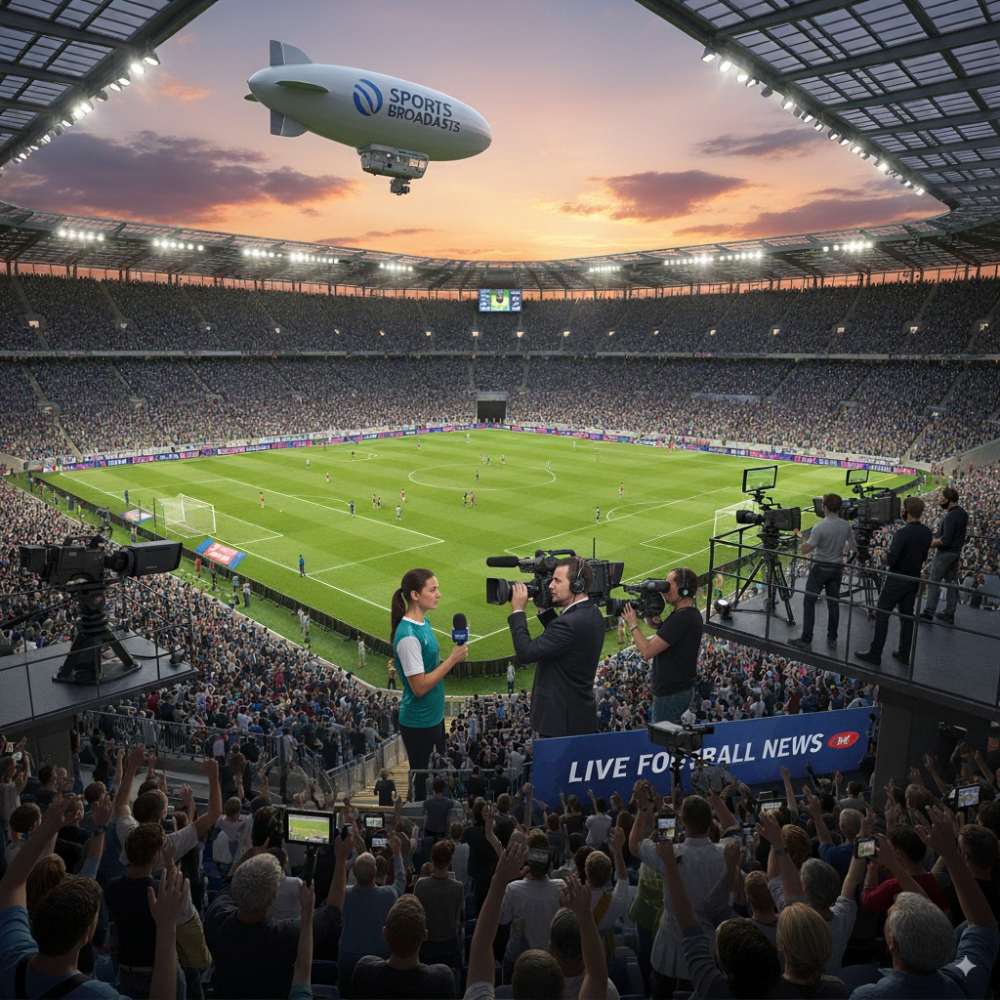
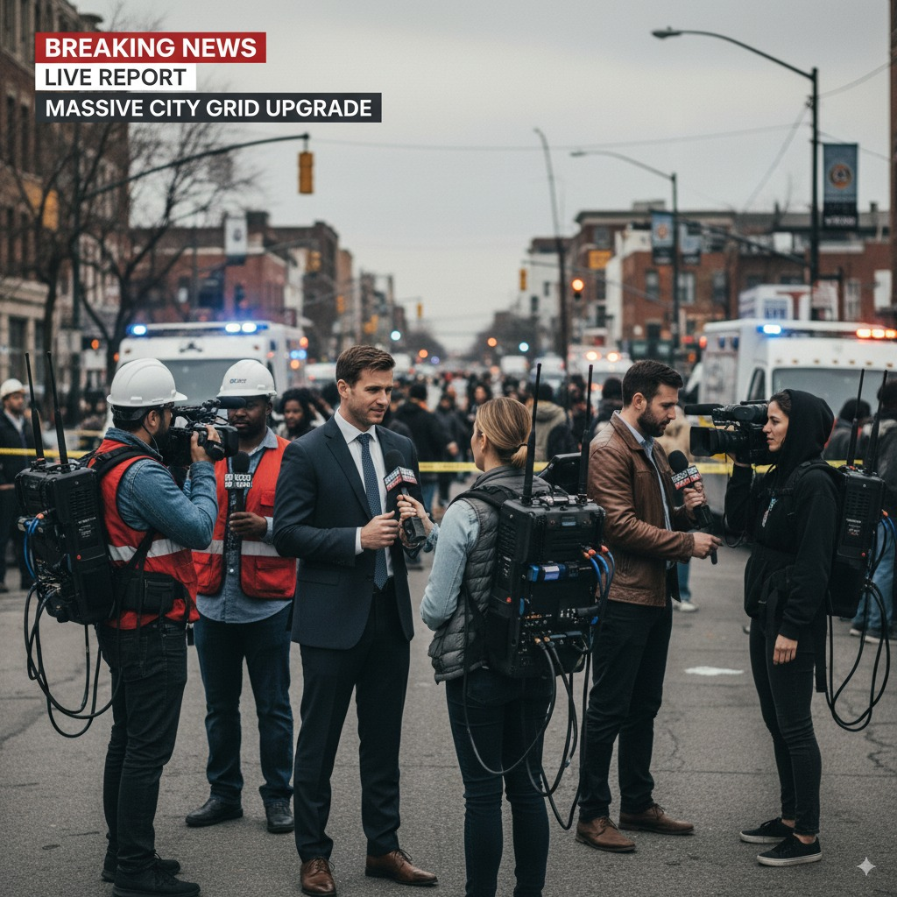

<svg xmlns="http://www.w3.org/2000/svg" viewBox="0 0 24 24" fill="none" stroke="currentColor" stroke-width="2" stroke-linecap="round" stroke-linejoin="round"><path stroke="none" d="M0 0h24v24H0z" fill="none" />
  <path d="M4 13h5"/><path d="M12 16v-8h3a2 2 0 0 1 2 2v1a2 2 0 0 1 -2 2h-3"/><path d="M20 8v8"/><path d="M9 16v-5.5a2.5 2.5 0 0 0 -5 0v5.5"/></svg>

Network APIs
<h1>Content Production & Contribution</h1>

:::warning
This documentation is currently **under development and subject to change**. It reflects outcomes elaborated by 5G-MAG members. If you are interested in becoming a member of the 5G-MAG and actively participating in shaping this work, please contact the [Project Office](https://www.5g-mag.com/contact)
:::

## Introduction: Content Production and Contribution over Mobile Networks

## Overview

This work area looks at how mobile networks can support professional content production and contribution, that is, capturing media in the field or at a venue and sending it (uplinking) to a production centre or the cloud. 5G-MAG investigates whether Network APIs, standard interfaces that let an application ask the mobile network for specific treatment beyond best-effort connectivity, can meet the quality and reliability needs of these scenarios. A Network API exposes a network capability (for example guaranteed bandwidth or low latency) to an application without requiring the developer to understand the underlying 3GPP network. The analysis is aimed at media technologists and developers evaluating cellular connectivity for live production.

Wireless connectivity plays a key role in content production and contribution scenarios such as production in studios, coverage of live in-venue (a football match) or on-the-move (the Tour de France) events, commentary stands (at a convention), and newsgathering (breaking news in the street). These different setups have unique infrastructure and equipment needs, and can benefit from connectivity with varying QoS requirements.

The scenarios below are not isolated anecdotes; they illustrate the same underlying trade-off. The choice to use wireless connectivity, and how, is not limited to specific scenarios or production levels: it is a strategic balance between cost, tolerance for technical glitches, risk of failure, and the quality and importance of the content. Examples are given below.

## Diversity in connectivity needs in the same deployment scenario

<table>
  <tr>
    <td markdown="span" align="center" width="20%"><figure></figure></td>
    <td markdown="span" align="left">Media production scenarios often require a mix of connectivity solutions to meet a variety of needs. For example, during a football match, a production team uses high-quality cameras for the main broadcast, while a commentator stand might have additional wireless cameras for pre-game interviews. Wireless cameras are also deployed outside the stadium to capture interviews with the crowd at the entrance of the stadium. Similarly, a major event like the coronation of King Charles III brought together numerous TV producers. They used a combination of dedicated, high-quality streams for the main ceremony and various other setups for newsgathering and interviews from journalists deployed around the site. This demonstrates how a single event can have multiple connectivity needs, from high-bandwidth main broadcasts to more flexible, on-the-go reporting. This is independent of the overall cost or budget of the whole event.</td>
  </tr>
</table>

## Immediacy Over Quality

<table>
  <tr>
    <td markdown="span" align="center" width="20%"><figure></figure></td>
    <td markdown="span" align="left">When a sudden street event unfolds, the only way to cover it is with smartphones on a best-effort connection. Getting any live footage is far more valuable than dismissing the connection due to its unreliability. While the video might not be broadcast-quality, the immediate, raw footage from the scene is critical for covering the event as it happens.</td>
  </tr>
</table>

## Agility over Cost

<table>
  <tr>
    <td markdown="span" align="center" width="20%"><figure></figure></td>
    <td markdown="span" align="left">For both sudden and partially-planned events, cellular bonding systems have emerged as cost-effective solutions to eliminate the need for e.g. dedicated satellite feeds, making live reporting from a wider range of locations economically viable. The equipment itself may be a major investment. The backpacks, modems, and SIM cards are not inexpensive and the news organization has to pay for a data plan for each SIM card and a service fee to the external company that provides the bonding infrastructure. Cellular bonding is needed as a single best-effort public mobile network cannot guarantee reliability. The news organization will plan where to send the different journalists that will provide reports from remote locations during the news programme. Covering sudden events with cellular bonding equipment is also usual, which may achieve better reliability than the connectivity via a single smartphone.</td>
  </tr>
</table>

## Dynamic Footage over Signal Stability

<table>
  <tr>
    <td markdown="span" align="center" width="20%"><figure></figure></td>
    <td markdown="span" align="left">High-mobility cameras introduce the unique challenge of seamlessly mixing their footage (generally highly engaging) into a high-quality production that includes wired cameras with reliable connections. This means the wireless setup needs to be as stable as possible, whereas the nature of its constant motion, changing environments, and potential signal obstructions makes that challenging with frequent signal fades or brief drops in connectivity. Despite these issues, the value of the unique camera perspective is prioritized. A camera on a referee provides an on-field view of the action and is critical for live replays and enhancing the narrative of the game. A camera on a motorbike in the Tour de France provides up-close views of the riders that a stationary camera could never capture.</td>
  </tr>
</table>

## Beyond best-effort connectivity: exposure of network capabilities

The fundamental trade-off in using wireless connectivity for media is that as a connection becomes more reliable, it enables more high-quality content to be delivered on it.
Historically, media was uplinked using highly reliable satellite and RF technologies. Today, the widespread availability of public mobile networks or LEO satellite constellations triggered a shift toward more agile tools like smartphones, cellular bonding packs or wireless modems.
The exposure of network capabilities to applications represents an opportunity to exploit advanced network features beyond best-effort connectivity. Examples of network capabilities may include on-demand quality, user equipment (UE) management, precise time synchronization,... Accessing and utilizing the desired features can be intricate and inconsistent across different networks. Several initiatives are taking shape to explore the opportunities behind Network APIs (exposing network capabilities to API consumers), offering high-level abstractions of underlying network functionalities to simplify resource utilization for non-network experts.

## What we are doing

At 5G-MAG we’re investigating the possibility of using network APIs to meet certain requirements for Content Production and Contribution scenarios over mobile networks.

The focus is on capabilities such as on-demand quality (guaranteed bandwidth, latency and jitter for contribution feeds), dedicated connectivity (network slices reserved for an event) and connectivity monitoring. These are analysed through the [CAMARA](https://camaraproject.org/) APIs (for example Quality on Demand, Network Slice Booking and Connectivity Insights) and their mapping to the underlying 3GPP service-based interfaces exposed via the Network Exposure Function (NEF), the 5G core function that exposes network capabilities to outside applications. See the [Network API Initiatives](../network-api-initiatives) page for the detailed analysis.

Read the sections in order:
1. [Reference Scenarios](./scenarios): the two production setups analysed here.
2. [Workflows](./workflows): the requirements and the steps for booking and using network capabilities.
3. [Using CAMARA APIs](./using-camara-apis): how specific CAMARA APIs map onto those steps.

## Why network APIs, and what "beyond best-effort" means in 3GPP terms

By default a mobile subscription gives an application best-effort connectivity: the network carries the traffic but makes no commitment on throughput, latency, jitter or loss, and treats the flow the same as any other. In 3GPP the treatment a flow receives is described by a QoS Flow, identified by a 5G QoS Identifier (5QI). Best-effort traffic typically maps to the non-Guaranteed Bit Rate (non-GBR) default 5QI 9. Professional contribution needs the opposite: a Guaranteed Bit Rate (GBR) or Delay-Critical GBR treatment with a committed uplink rate and bounded delay. The standardised 5QI values and their characteristics (resource type, priority level, packet delay budget, packet error rate) are listed in 3GPP [TS 23.501](https://www.3gpp.org/dynareport/23501.htm), clause 5.7.4, Table 5.7.4-1. A Network API is the mechanism by which a media application asks the operator to apply such a treatment to its flows without the application developer having to understand the 5G Core.

Network capability exposure is the 3GPP feature that makes this possible. The Network Exposure Function (NEF) sits at the edge of the 5G Core and exposes selected capabilities to external Application Functions (AFs) over the northbound APIs defined in [TS 29.522](https://www.3gpp.org/dynareport/29522.htm). A QoS request typically resolves to an `Nnef_AFSessionWithQoS` operation, which the NEF forwards to the Policy Control Function (PCF) via `Npcf_PolicyAuthorization` ([TS 29.514](https://www.3gpp.org/dynareport/29514.htm)); the PCF then installs policy on the relevant PDU session. Advance reservation for a future time window maps instead to background data transfer negotiation (`Nnef_BDTPNegotiation`, [TS 29.554](https://www.3gpp.org/dynareport/29554.htm)). The [Network API Initiatives](../network-api-initiatives) page documents these 3GPP service-based interfaces in detail.

## Where CAMARA fits

[CAMARA](https://camaraproject.org/) is an open-source project (hosted by the Linux Foundation, aligned with the GSMA Open Gateway initiative) that defines developer-friendly REST APIs abstracting the 3GPP capabilities above. Instead of speaking to the NEF directly, a media application calls a CAMARA API such as Quality on Demand, referencing a named QoS profile the operator has published. The operator's Network API Platform maps that named profile onto the appropriate 5QI and drives the underlying NEF/PCF procedures. Because CAMARA is transport-agnostic and operator-neutral, the same application code can target multiple operators, optionally through an aggregator (see the [GSMA Open Gateway](https://www.gsma.com/solutions-and-impact/gsma-open-gateway/) and [GSMA Operator Platform](https://www.gsma.com/solutions-and-impact/technologies/networks/operator-platform-hp/) programmes).

The capabilities most relevant to contribution, and the CAMARA APIs 5G-MAG analyses for each, are:

- **On-demand quality** (committed uplink throughput, bounded latency and jitter for a contribution feed): the [Quality on Demand](./using-quality-on-demand), [QoS Booking](./using-qos-booking) and [QoS Booking and Assignment](./using-qos-booking-assignment) APIs, all referencing a named [QoS Profile](./using-qos-profiles).
- **Advance reservation for a time and place** (booking resources before an event, at a venue): the [Dedicated Networks](./using-dedicated-networks) and Network Slice Booking APIs, which separate reservation from device assignment.
- **Connectivity monitoring and assistance** (checking whether the network can meet the flow's needs, and being notified when it cannot): the Connectivity Insights and Connectivity Insights Subscriptions APIs, which reference an Application Profile.

The [Using CAMARA APIs](./using-camara-apis) page maps each API onto the five phases (discovery, reservation, assignment, usage, notifications) drawn from the [Workflows](./workflows) analysis, and records where the current CAMARA APIs fall short of the media requirements (for example, no pre-booking availability lookup for a location and time, and separate profiles for requesting resources versus monitoring them).

## Scope and neutrality

This analysis reflects work in progress by 5G-MAG members and does not assert that any specific operator offers these capabilities commercially today. The CAMARA APIs referenced are at differing maturity levels (several are incubating), and the mapping to media contribution surfaces gaps that are open questions in both CAMARA and 3GPP. Where a requirement has no clean CAMARA answer, the analysis says so rather than implying one exists.

## Related

* [Reference Scenarios](./scenarios): single-device and multi-device contribution setups.
* [Workflows and Requirements](./workflows): the phases and the 5G-MAG requirement categories.
* [Using CAMARA APIs](./using-camara-apis): the API-by-phase mapping.
* [Network API Initiatives](../network-api-initiatives): the CAMARA APIs and the 3GPP interfaces they map onto.
* [Live Media Distribution](../live-media-distribution/introduction): the same APIs analysed from the delivery (downlink) side.

:::note
Refer to the [Tech](https://github.com/5G-MAG/Tech/) repository to contribute to this documentation.
:::
