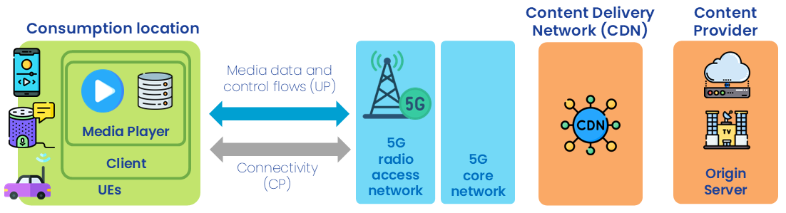

:::warning
This documentation is currently **under development and subject to change**. It reflects outcomes elaborated by 5G-MAG members. If you are interested in becoming a member of the 5G-MAG and actively participating in shaping this work, please contact the [Project Office](https://www.5g-mag.com/contact)
:::

## Scenarios and Use Cases: Live Media Distribution

In the reference scenario, a content provider streams live media (for example a radio or TV service) over the top (OTT) to a large population of consumer devices, with a content delivery network (CDN) at the source and the mobile network carrying the content to each device. When a consumer sees a degraded experience, the cause could lie in the CDN, the client application, the radio link or somewhere inside the operator's network. The purpose of this scenario is to identify who can observe which part of the delivery chain, so that a Network API can help share that information and close the visibility gap. The actors and their vantage points are described below.

<figure>
  
  <figcaption>High-level Live Media Distribution chain and the actors involved.</figcaption>
</figure>

## Actors

The actors involved are:
  - **Content Provider**, distributes live media content to consumers, typically "over the top" (OTT) via a CDN. The content provider wants to understand how well its content is being delivered and to diagnose poor performance. It has visibility of the two ends of the distribution chain: the source (the CDN in this context) and the client application running on the consumer device.
  - **Consumer/End User**, accesses the live media content through a client application (e.g. on a smartphone or other connected device). The client application can log relevant performance data, such as the time taken to deliver each media segment (time to last byte, TTLB) for MPEG-DASH services.
  - **CDN Operator**, hosts and serves the media content from the source end of the distribution chain. CDN logs can often be inspected to rule the CDN in or out as the cause of poor performance.
  - **Network Operator**, provides the network carrying the content between the CDN and the consumer device. The operator has far greater visibility of what happens inside its own network but, for third party (OTT) services where it has no access to the client application, typically lacks visibility of the full distribution chain. A set of network capabilities can be exposed through APIs (referred to as Network APIs in the following).
  - **Aggregator (optional)**, provides access to the network capabilities of different Network Operators. See [GSMA Open Gateway](https://www.gsma.com/solutions-and-impact/gsma-open-gateway/) and [GSMA Operator Platform](https://www.gsma.com/solutions-and-impact/technologies/networks/operator-platform-hp/) as examples.

## Who can observe which part of the chain

The purpose of the scenario is to make the observability boundaries explicit, because they are what a Network API would have to bridge. The table below maps each link of the distribution chain to the actor (or actors) that can see it.

<table>
  <tr>
    <td markdown="span" align="left"><b>Link in the chain</b></td>
    <td markdown="span" align="left"><b>Content provider</b></td>
    <td markdown="span" align="left"><b>Network operator</b></td>
    <td markdown="span" align="left"><b>How</b></td>
  </tr>
  <tr>
    <td markdown="span" align="left">CDN / origin (source)</td>
    <td markdown="span" align="left">Yes</td>
    <td markdown="span" align="left">No</td>
    <td markdown="span" align="left">CDN logs (segment requests served, cache hits, errors).</td>
  </tr>
  <tr>
    <td markdown="span" align="left">Operator core and transport</td>
    <td markdown="span" align="left">No ("The Cloud")</td>
    <td markdown="span" align="left">Yes</td>
    <td markdown="span" align="left">Operator's own network monitoring, for its own traffic.</td>
  </tr>
  <tr>
    <td markdown="span" align="left">Radio link (RAN)</td>
    <td markdown="span" align="left">Partial</td>
    <td markdown="span" align="left">Yes</td>
    <td markdown="span" align="left">Provider sees client-reported radio indicators (cell ID, signal strength, signal quality); operator sees the RAN directly.</td>
  </tr>
  <tr>
    <td markdown="span" align="left">Client application (device)</td>
    <td markdown="span" align="left">Yes</td>
    <td markdown="span" align="left">No (for third-party OTT)</td>
    <td markdown="span" align="left">In-app instrumentation: per-segment time to last byte (TTLB), rebuffering events, errors.</td>
  </tr>
</table>

The gap is the diagonal: the content provider cannot see the operator's core and transport (only their aggregate effect), and the operator cannot see the client app of a third-party service. A failure such as uplink interference that prevents a segment request from reaching the network falls into both blind spots at once, because the provider only observes a slow or failed segment (a high or infinite TTLB) while the operator observes no request at all. Sharing app-side data (TTLB, radio indicators, error events) with the operator, and network-side context back to the provider, is what a Network API such as Connectivity Insights would enable.

## Diagnosis logic

Given the observability boundaries, the content provider's fault-isolation follows a process of elimination:

1. **Rule the CDN in or out** by inspecting CDN logs. If the CDN served the segment promptly, the source is not the cause.
2. **Rule out insufficient radio coverage** using the client-reported radio indicators. Weak signal explains many degradations without any network fault.
3. **What remains is attributed to "the network"**, which the provider cannot see. This is precisely the residual that a data-sharing Network API is meant to illuminate, by letting the operator confirm whether it observed the traffic and how it treated it.

## From scenario to APIs

Two needs follow from the scenario: assuring **quality of service** for reliable segment delivery to a large device population, and **sharing monitoring information** to close the visibility gap. The [Workflows](./workflows) page turns these into phased procedures and requirements (including the region-specific [geofencing](./workflows#geofencing) need); the [Using CAMARA APIs](./using-camara-apis) page maps them onto candidate CAMARA APIs (Quality on Demand and QoS Profiles for QoS; Application Profiles with Connectivity Insights and its subscription variant for monitoring).

## Related

* [Introduction](./introduction): the visibility gap and where network APIs fit.
* [Workflows and Requirements](./workflows): the phases, and the QoS, monitoring and geofencing requirements.
* [Using CAMARA APIs](./using-camara-apis): the candidate APIs mapped to the phases.
* [Content Production scenarios](../content-production/scenarios): the contribution-side actors and setups.
* [Network API Initiatives](../network-api-initiatives): the CAMARA APIs and the 3GPP interfaces.

:::note
Refer to the [Tech](https://github.com/5G-MAG/Tech/) repository to contribute to this documentation.
:::
