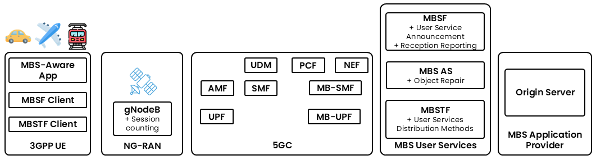

<svg xmlns="http://www.w3.org/2000/svg" viewBox="0 0 24 24" fill="none" stroke="currentColor" stroke-width="2" stroke-linecap="round" stroke-linejoin="round"><path stroke="none" d="M0 0h24v24H0z" fill="none" />
  <path d="M3.707 6.293l2.586 -2.586a1 1 0 0 1 1.414 0l5 5a1 1 0 0 1 0 1.414l-2.586 2.586a1 1 0 0 1 -1.414 0l-5 -5a1 1 0 0 1 0 -1.414z"/><path d="M6 10l-3 3l3 3l3 -3"/><path d="M10 6l3 -3l3 3l-3 3"/><path d="M14 17a3 3 0 0 0 3 -3"/><path d="M20 13a9 9 0 0 0 -9 9"/></svg>

Non-Terrestrial Networks
<h1>MBS Multicast NTN</h1>

:::warning
This documentation is currently **under development and subject to change**. If you are interested in becoming a member of the 5G-MAG and actively participating in shaping this work, please contact the [Project Office](https://www.5g-mag.com/contact)
:::

## Analysis - MBS Delivery Mode 1 (Multicast) over NTN

This page sets out the requirements for delivering MBS Multicast content over a Non-Terrestrial Network (NTN). A satellite base station (the Donor gNodeB) can switch each device on its own between point-to-point (PTP, a dedicated per-device channel) and point-to-multipoint (PTM, a shared channel serving many devices), depending on how many devices are receiving the service. The page covers the roles of the Application Service Provider and the NTN, device and subscription considerations, and mobility requirements.

For mobility handling specific to this scenario, see also [Analysis of Mobility aspects for MBS Multicast over NTN](./analysis-mobility-mbs-multicast-over-ntn).

## Standards background

MBS Multicast over NTN combines two existing pieces without inventing a new service layer:

* **MBS delivery mode 1 (multicast)**, defined in [TS 23.247](https://www.3gpp.org/dynareport/23247.htm), targets sessions that need higher QoS and is available to devices in RRC_CONNECTED. The RAN can switch a device between point-to-point (PTP) and point-to-multipoint (PTM) delivery of the same multicast session; that autonomous switching is the central mechanism on this page. The MBS user-service layer above the transport is specified by SA4 in [TS 26.502](https://www.3gpp.org/dynareport/26502.htm), and 5G Media Streaming, which MBS user services extend, in [TS 26.501](https://www.3gpp.org/dynareport/26501.htm).
* **NTN access**, defined at radio level in [TS 38.300](https://www.3gpp.org/dynareport/38300.htm) and [TS 38.331](https://www.3gpp.org/dynareport/38331.htm) (with the study background in [TR 38.811](https://www.3gpp.org/dynareport/38811.htm) and [TR 38.821](https://www.3gpp.org/dynareport/38821.htm)), which the multicast session simply runs over. The Donor gNodeB referred to below is the NR base station (in NTN terms the Satellite Access Node), whether ground-based (Transparent Payload) or on board (Regenerative Payload).

The reason MBS Multicast fits NTN well is spectral efficiency: satellite spectrum is scarce, so serving many concurrent devices from one PTM transmission is attractive, while PTP remains available for the few or for reliability during handover.

## Requirements and Overview for the delivery of multicast content with autonomous RAN switching between point-to-point and point-to-multipoint

The figure below shows the MBS Multicast over NTN scenario: an Application Service Provider feeds multicast services into the 5G Core of the NTN, and the Donor gNodeB delivers them to devices over PTP or PTM.

### Application Service Provider
* An Application Service Provider makes available over the Internet services (e.g. TV, radio, any linear/live streaming service) which users can access through an application installed on their devices (e.g. a smartphone, a smart TV, tablet, etc.).
*	The Application Service Provider additionally provisions these as multicast services in the 5G Core of the NTN.

:::warning
To be checked: Provision of MBS Multicast services over the 5G Network with traffic originally coming from a streaming service available over the internet and to client applications already deployed in user equipment.
Note that this is an aspect related to MBS and it is captured here: [MBS Service Layer Aspects](../5g-mbs/mbs-service-layer)
:::

### Network and access to services
*	The gNodeB of the NTN (“Donor gNodeB”) is deployed either at the ground station (Transparent Payload architecture) or on board the spacecraft (Regenerative Payload, not illustrated).
*	The NTN operator offers mobile broadband access to their subscribed users.
*	The NTN supports multicast user services.
*	A set of multicast services is provisioned in the NTN that deliver content to UEs using either point-to-point or point-to-multipoint multicast communication, at the discretion of the Donor gNodeB.
*	Optionally, the NTN operator may collaborate with the Application Service Provider to ensure the delivery of content with a desired Quality of Service, including the provision of network assistance and/or UE data collection and reporting, among other functionalities.
*	The NTN has the ability to detect concurrent consumption of services by multiple users and may use parameters such as session counting to trigger unicast-to-multicast switching at upper layers.
*	The Donor gNodeB is able to autonomously switch the delivery mode of multicast packets between point-to-point and point-to-multipoint according to the number of UEs attempting to receive multicast user services concurrently.

:::warning
To be checked: Provision of MBS Multicast services which can be delivered either by means of point-to-point or point-to-multipoint and the mechanism by which concurrent consumption of a service by multiple users and session counting is performed.
Note that this is an aspect related to MBS and it is captured here: [MBS Service and System Aspects](../5g-mbs/mbs-service-system-aspects)
:::

### Device considerations
*	User Equipment directly connected to the NTN (including UEs or a Mobile Relay Node in a moving platform) requires subscription and registration with the NTN operator in order to obtain mobile broadband connectivity and access to the desired services.
*	In addition, the NTN operator authorises UEs that are able to consume multicast user services.
*	In order to obtain network connectivity and access to the desired services, User Equipment connected to a Mobile Relay Node within a moving platform requires either subscription and registration with the moving platform network operator (which could be the same as or different from the NTN operator) or directly with the NTN operator.

### Mobility, handover, service interruption and reliability requirements
*	The delivery of multicast data packets using point-to-point or point-to-multipoint transmission should rely on mechanisms that ensure reliability and in-sequence delivery. User Equipment should be able to request repair of faulty or lost multicast data packets to increase delivery reliability.
*	For critical applications, lossless mobility without interruption should be guaranteed when UEs transit across different satellite coverage areas, even when those different coverage areas are served by different NTNs operated by the same NTN operator (e.g. from LEO to GEO with a common 5G Core). Interruption-free multicast user service should be guaranteed when a UE is served from a gNodeB which switches multicast packet delivery from point-to-multipoint to point-to-point communication and vice versa.
*	For services with less stringent requirements, some level of multicast user service interruption may be tolerable when a UE transits across different coverage areas, including when those different coverage areas are served by different NTNs. Some level of interruption may be tolerable when a UE is served from a gNodeB which switches multicast packet delivery from point-to-multipoint to point-to-point communication and vice versa.

:::warning
To be checked: Mobility aspects in relation to NTN are captured here: [Aspects on Mobility for NTN](../ntn/analysis-mobility-ntn). Mobility aspects in relation to MBS are captured here: [Aspects on Mobility for MBS Multicast Services](../5g-mbs/mobility-mbs-multicast). Mobility aspects in relation to MBS and NTN are captured here: [Aspects on Mobility for MBS Multicast over NTN](../ntn/analysis-mobility-mbs-multicast-over-ntn)
:::

## Autonomous PTP/PTM switching

The defining feature of this scenario is that the Donor gNodeB decides, on its own, whether to deliver a multicast session over a shared PTM channel or a dedicated PTP channel, and can move a device between the two without the application being aware.

* **When PTM is used.** When enough devices in the same beam are receiving the same session, one PTM transmission serves them all and is by far the most efficient use of the scarce satellite spectrum. This is the normal state for popular content in a wide beam.
* **When PTP is used.** When only one or very few devices are receiving, PTP can be more efficient and gives per-device link adaptation and retransmission. PTP is also used deliberately during handover to protect a device that is about to lose its beam (see the mobility page).
* **What triggers a switch.** The network detects concurrent consumption, for example by session counting at upper layers, and switches unicast-to-multicast or the reverse. Over NTN, geometry adds a second trigger: an imminent beam change known from the ephemeris can justify moving a device to PTP before the handover rather than waiting for the radio to degrade.

The requirement that switching be interruption-free is what ties this to reliability: a device must not lose or reorder packets when it moves between PTP and PTM. This is why the page calls for mechanisms that ensure reliability and in-sequence delivery, and why application-layer repair (a device requesting retransmission of lost objects) is important over satellite paths where lower-layer retransmission is expensive.

## Standards mapping

| Aspect on this page | Where it is specified |
| --- | --- |
| Multicast session, delivery mode 1, PTP/PTM switching | TS 23.247 (MBS architectural enhancements) |
| MBS user services and media formats above transport | TS 26.502; TS 26.501 (5G Media Streaming) |
| NTN radio access and system information | TS 38.300, TS 38.331; TR 38.811, TR 38.821 |
| Satellite access in the 5G system architecture | [TR 23.737](https://www.3gpp.org/dynareport/23737.htm); [TS 23.501](https://www.3gpp.org/dynareport/23501.htm), [TS 23.502](https://www.3gpp.org/dynareport/23502.htm) |
| Mobility for the multicast group over NTN | [Mobility for MBS Multicast over NTN](./analysis-mobility-mbs-multicast-over-ntn) |

:::caution[References to verify]
These identifiers on this page were not confirmed against a primary source (the 3GPP/ETSI portals block automated access): TS 26.502 title, the exact TS 23.247 clauses for PTP/PTM switching and session counting, and the release placement of MBS-over-NTN features (broadcast/multicast, GSO/NGSO). Verify against the 3GPP work plan before publication.
:::
