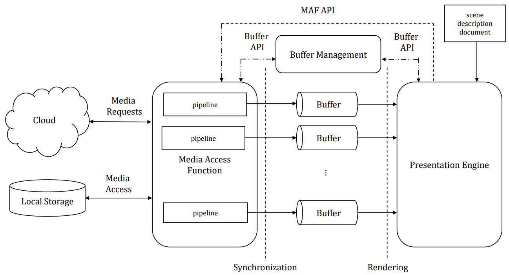
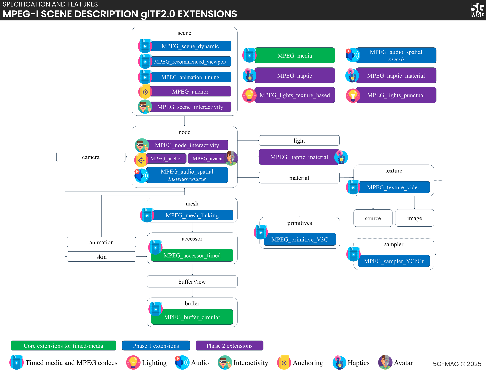

<svg xmlns="http://www.w3.org/2000/svg" viewBox="0 0 24 24" fill="none" stroke="currentColor" stroke-width="2" stroke-linecap="round" stroke-linejoin="round"><path stroke="none" d="M0 0h24v24H0z" fill="none" />
  <path d="M10 9a2 2 0 1 0 4 0a2 2 0 0 0 -4 0"/><path d="M8 16a2 2 0 0 1 2 -2h4a2 2 0 0 1 2 2"/><path d="M3 7v-2a2 2 0 0 1 2 -2h2"/><path d="M3 17v2a2 2 0 0 0 2 2h2"/><path d="M17 3h2a2 2 0 0 1 2 2v2"/><path d="M17 21h2a2 2 0 0 0 2 -2v-2"/></svg>

XR and MPEG-I Scene Description
<h1>MPEG-I Scene Description</h1>

:::warning
This documentation is currently **under development and subject to change**. It reflects outcomes elaborated by 5G-MAG members. If you are interested in becoming a member of the 5G-MAG and actively participating in shaping this work, please contact the [Project Office](https://www.5g-mag.com/contact)
:::

## Overview - MPEG-I Scene Description and glTF 2.0 Extensions

This page explains the MPEG-I Scene Description model that underpins 5G-MAG's XR work: what it is, the reference architecture that plays back a scene, and the glTF 2.0 extensions that add timed and immersive media. For the wider XR context and reference tools, see the parent [XR and MPEG-I Scene Description](../xr) page.

MPEG-I Scene Description (MPEG-I SD, ISO/IEC 23090-14) is a standard developed by MPEG (the Moving Picture Experts Group) for immersive media. It defines the structure and composition of a 3D scene, referencing and positioning 2D and 3D assets so the scene can be rendered properly, with support for real-time media delivery and interactivity.

MPEG-I SD builds on glTF (GL Transmission Format), which was chosen as the base scene-description technology. Developed by the Khronos Group, glTF is an open standard for describing 3D model geometry, appearance, scene hierarchy, and animation, and is designed to be rendered by graphics APIs such as OpenGL. Khronos has adopted the MPEG-I Scene Description extensions as defined in the [Khronos glTF extensions registry](https://github.com/KhronosGroup/glTF/blob/main/extensions/README.md).

## Reference architecture
MPEG-I SD defines the following reference architecture. It shows how a scene flows from the media source, through the Media Access Function (MAF) and Buffers, to the Presentation Engine that renders it. The figure below sets out these components and their connections.

<figure>
  
  <figcaption>MPEG-I Scene Description reference architecture: Presentation Engine, Media Access Function (MAF) and Buffers.</figcaption>
</figure>

* The Presentation Engine replaces a traditional 2D media player. It is responsible for multi-modal rendering of a scene composed of audiovisuals and haptics media. It also provides information about the viewer's and object pose to optimize delivery.
* The Presentation Engine delegates media handling to the Media Access Function (MAF), which is responsible for media access and processing. The MAF constructs a suitable media pipeline to transform media from a delivery format into the formats used during rendering, using MIME type and codec parameters (the standard content-type and codec identifiers carried with each media object) to work out which formats it must support and assemble the correct pipeline.
* The MAF API is used by the Presentation Engine to request immersive media in the scene.
* The Buffers are fed by the processed media with a format defined through the scene description document in ISO/IEC 23090-14

## Vendor extensions to Khronos glTF 2.0

A glTF extension is a named, optional addition to the base glTF format that lets vendors describe capabilities the core format does not cover; a renderer that understands an extension can use it, and one that does not can ignore it. MPEG defines several such extensions, shown grouped by purpose in the figure below.

The figure groups the extensions by colour: the green group adds the timed framework, the blue group adds dynamic and temporal media, and the purple group adds real-time immersive and interactive media. The three groups are also listed in prose below, so the grouping does not depend on the colours.

<figure>
  
  <figcaption>MPEG vendor extensions to glTF 2.0, grouped by purpose (green: timed framework; blue: dynamic and temporal media; purple: real-time immersive and interactive media).</figcaption>
</figure>

A first set of extensions (green in the figure) enable the timed framework including:
* [MPEG_media](https://github.com/KhronosGroup/glTF/blob/main/extensions/2.0/Vendor/MPEG_media/README.md), which enables the referencing of external media streams that are delivered over protocols such as RTP/SRTP, MPEG-DASH, or others
* [MPEG_accessor_timed](https://github.com/KhronosGroup/glTF/blob/main/extensions/2.0/Vendor/MPEG_accessor_timed/README.md), used in a scene that contains timed media and/or metadata to describe access to the dynamically changing data
* [MPEG_buffer_circular](https://github.com/KhronosGroup/glTF/blob/main/extensions/2.0/Vendor/MPEG_buffer_circular/README.md), to extend the buffer into a circular buffer

A second group of extensions (blue in the figure) enables the inclusion of dynamic and temporal media including:
* [MPEG_texture_video](https://github.com/KhronosGroup/glTF/blob/main/extensions/2.0/Vendor/MPEG_texture_video/README.md), provides the possibility to link a texture object defined in glTF 2.0 to media and its respective track
* [MPEG_audio_spatial](https://github.com/KhronosGroup/glTF/blob/main/extensions/2.0/Vendor/MPEG_audio_spatial/README.md), to support spatial audio
* [MPEG_mesh_linking](https://github.com/KhronosGroup/glTF/blob/main/extensions/2.0/Vendor/MPEG_mesh_linking/README.md), provides the possibility to link a mesh to another mesh in a glTF asset
* [MPEG_scene_dynamic](https://github.com/KhronosGroup/glTF/blob/main/extensions/2.0/Vendor/MPEG_scene_dynamic/README.md), [MPEG_viewport_recommended](https://github.com/KhronosGroup/glTF/blob/main/extensions/2.0/Vendor/MPEG_viewport_recommended/README.md), and [MPEG_animation_timing](https://github.com/KhronosGroup/glTF/blob/main/extensions/2.0/Vendor/MPEG_animation_timing/README.md), which indicate that a particular form of timed data is provided to the Presentation Engine during the consumption of the scene and that it shall adapt to the changing information.

A third group of extensions (purple in the figure) enables the distribution of real-time immersive and interactive media content including:
* Augmented Reality anchor (MPEG_anchor), to support AR experiences where virtual content is inserted into the user's real environment
* Interactivity (MPEG_scene_interactivity, MPEG_node_interactivity), to describe interactivity at runtime with support for interactions between user and virtual objects and between virtual objects, with triggers based on proximity, visibility, collision or user input.
* Avatar (MPEG_avatar), to support the representation of 3D avatars.
* Lighting (MPEG_lights_texture_based, MPEG_light_punctual), to provide a realistic user experience including shadows and lighting.
* Haptics (MPEG_haptic), to support haptics based on the MPEG standard for Coded representation of Haptics by attaching haptic information to a node or to a mesh.

## How timed media reaches the renderer

The three extension groups above work together to bring streaming media into an otherwise static glTF scene. The mechanism is worth following end to end, because it is the part of ISO/IEC 23090-14 that differs most from plain glTF.

* **Declaring the source.** `MPEG_media` declares one or more media items at the top level of the glTF document, each with one or more alternatives (for example the same content at different bitrates or in different codecs) and a URI. The URI can point to an MPEG-DASH MPD, an RTP source, a local file, or another supported source. This is a declaration, not a fetch; nothing is retrieved until the Presentation Engine asks for it.
* **Binding into the scene.** An asset in the scene references that media indirectly. A video texture uses `MPEG_texture_video` to bind a glTF texture to a track of an `MPEG_media` item; a spatial audio source uses `MPEG_audio_spatial`; a dynamic geometry stream binds through the timed accessor. The binding always goes through a glTF **accessor**, so the renderer reads timed data using the same accessor concept it already uses for static vertex data.
* **Timed accessors and circular buffers.** A normal glTF accessor points at a fixed region of a buffer. `MPEG_accessor_timed` marks an accessor whose contents change over time, and `MPEG_buffer_circular` turns the backing buffer into a ring buffer with multiple frames in flight. Each buffer frame carries a header (timestamp and length) so the Presentation Engine can pick the frame that matches the current presentation time and detect underflow or stale data. This is how the renderer stays synchronised with a stream it does not itself decode.

## The MAF API and the buffer interface

The split between the Presentation Engine and the Media Access Function is defined by two interfaces.

* The **MAF API** is called by the Presentation Engine to initialise, start, update and stop a media pipeline for a referenced media object. On initialisation the Presentation Engine passes the media information from `MPEG_media` and the buffer configuration; it can also pass view information (viewer and object pose) so the MAF can optimise fetching, for example by requesting only visible tiles or a viewport-appropriate quality. The MAF selects one of the declared alternatives, builds the access/decode pipeline, and reports the format it will write.
* The **buffer API** governs the buffers between the two roles. The MAF writes decoded, render-ready data into the buffers (respecting the format the scene requested); the Presentation Engine reads from them at render time. Circular buffers decouple the two rates, so jitter in access and decoding does not stall rendering as long as the buffer stays filled.

The result is that the Presentation Engine never needs to know the transport or codec of a media object. It knows only the scene, the accessors, and the buffer contract. Anything from a DASH-delivered video texture to an RTP-delivered point cloud looks the same from the renderer's side, which is what makes a single scene document portable across delivery methods and devices.

## Editions and amendments

ISO/IEC 23090-14 has evolved since its first publication:

* **First edition (2023).** Established the base extensions, the MAF/Presentation Engine model and the buffer interfaces on top of glTF 2.0.
* **Amendment 1.** Added support for MPEG-I immersive audio, scene understanding and related extensions.
* **Amendment 2** (in development at the time of writing). Adds support for haptics, augmented reality, avatars, interactivity, MPEG-I audio and lighting; several of the purple-group extensions above (`MPEG_anchor`, the interactivity extensions, `MPEG_avatar`, the lighting extensions, `MPEG_haptic`) originate here.
* **Second edition (2025).** Consolidates the base text and amendments into a single document.

Because features arrived across editions and amendments, a given implementation may support only a subset of the extensions. The developer-facing support matrix for the 5G-MAG reference tools is on the [XR scope page](https://hub.5g-mag.com/developer/xr/scope).

## Relationship to 3GPP delivery

MPEG defines the scene format; 3GPP defines how it is delivered over 5G and what a device must be able to play. Scene-description content and its referenced media can be carried using the 5G Media Streaming framework (3GPP [TS 26.501](https://www.3gpp.org/dynareport/26501.htm) architecture, [TS 26.512](https://www.3gpp.org/dynareport/26512.htm) protocols) for streamed cases, and over Real-Time Communication transports for conversational and split-rendering cases. On the device side, 3GPP [TS 26.119](https://www.3gpp.org/dynareport/26119.htm) (MeCAR) references MPEG-I Scene Description as media that an AR device must be able to consume, and aligns the on-device client with the Khronos OpenXR runtime API. For that wider delivery and device context, see the [XR and MPEG-I Scene Description](../xr) Tech page and the [Standards view](/tech/standards/xr).

:::caution[References to verify]
These identifiers on this page were not confirmed against a primary source (the 3GPP/ETSI portals block automated access): the current release placement and status of TS 26.119 (MeCAR). Verify against the 3GPP/ETSI work plan before publication.
:::

## Related

* [XR and MPEG-I Scene Description](../xr): the parent overview, with the XR reference tools and slide deck.
* [Avatar Communication with MPEG ARF](../avatar-communications): uses the `MPEG_avatar` extension described above for 3D avatar representation.
* [Standards: XR Media with MPEG-I Scene Description](/tech/standards/xr): the standards-tracking view of this topic.
