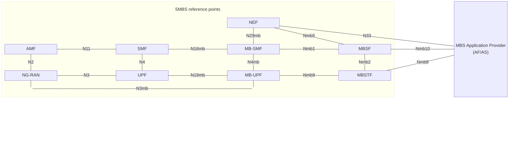
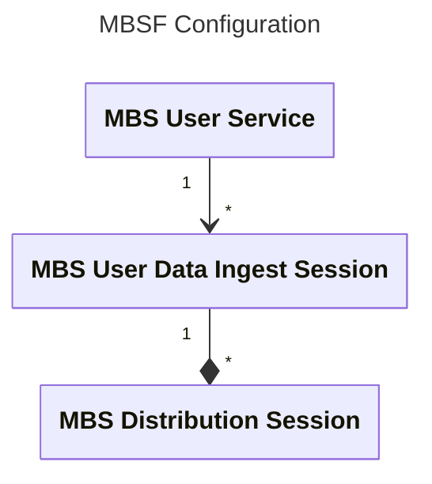

<div class="topic-banner">
<div class="topic-banner__icon-wrap">
<svg xmlns="http://www.w3.org/2000/svg" viewBox="0 0 24 24" fill="none" stroke="currentColor" stroke-width="2" stroke-linecap="round" stroke-linejoin="round" aria-hidden="true"><path stroke="none" d="M0 0h24v24H0z" fill="none" />
  <path d="M12 12l0 .01" />
  <path d="M14.828 9.172a4 4 0 0 1 0 5.656" />
  <path d="M17.657 6.343a8 8 0 0 1 0 11.314" />
  <path d="M9.168 14.828a4 4 0 0 1 0 -5.656" />
  <path d="M6.337 17.657a8 8 0 0 1 0 -11.314" /></svg>
</div>
<div class="topic-banner__text">
<span class="topic-banner__kicker">5G Multicast Broadcast Services (MBS)</span>
<h1>Operating the MBS Function (MBSF) and APIs</h1>
</div>
</div>

The MBS Function is responsible for controlling the MBS User Services sessions. It does this by managing MBS Sessions with the MB-SMF, managing MBS Distribution Sessions with the MBSTF(s) and creating and propagating the User Service Announcements. For acronyms used here, see the [Glossary](/tech/glossary).

The MBSF is configured by an Application Provider using the API at reference point Nmb10. This tutorial covers the use of the APIs at Nmb10 to configure the MBSF.

**What this covers:** the create, retrieve, update and delete (CRUD) operations for MBS User Services and MBS User Data Ingest Sessions over the Nmb10 API, plus example request bodies (service area, activation periods, carousel mode).

**What you will build:** a running MBSF that you drive over Nmb10 with `curl` (or Insomnia) to provision an MBS User Service and attach a Data Ingest Session to it.

:::note[Service Announcement status]
The MBSF implementation as tested in the main body of this tutorial manages the MB-SMF and MBSTF(s) but does not yet drive full Service Announcement provisioning over Nmb10. The [Analysing MBS User Service Announcements](#analysing-mbs-user-service-announcements) section at the end describes a separate, experimental path in which an MBS Application Function (AF) co-located with the MBSF serves announcement bundles; treat it as work in progress.
:::

## Tutorial videos

<iframe loading="lazy" width="560" height="315" src="https://www.youtube.com/embed/0re77KNmxYQ?si=PVTIFSEPJr6rMMPU" title="YouTube video player" frameborder="0" allow="accelerometer; autoplay; clipboard-write; encrypted-media; gyroscope; picture-in-picture; web-share" referrerpolicy="strict-origin-when-cross-origin" allowfullscreen></iframe>

## Architecture



## Prerequisites

This tutorial assumes that you have cloned and built the [rt-mbs-function repository](https://github.com/5G-MAG/rt-mbs-function) and [rt-mbs-transport-function repository](https://github.com/5G-MAG/rt-mbs-transport-function).

A 5G Core with UDP tunnelling should be running for these examples (unless using the _netcat_ package to fake an MB-UPF UDP tunnel) with at least the NRF, SCP, MB-SMF, MB-UPF and MB-AMF Network Functions (see the instructions in the [Open5GS 5MBS branch](https://github.com/5G-MAG/open5gs/tree/5mbs)).

For convenience, a bash script is provided that starts all required components including the MBSTF, 5GC NFs and Media Server using [tmux](https://github.com/5G-MAG/rt-mbs-examples/blob/main/scripts/tmux). The instructions to use the script can be found [here](https://github.com/5G-MAG/rt-mbs-examples/tree/main/scripts/tmux#mbsf-tutorial-startup-script). If you use the script you can omit some of the steps in this tutorial.

## Description

This tutorial covers the configuration of the MBSF via the APIs at reference point Nmb10. The configuration is split into 2 main areas, the MBS User Services and the MBS User Data Ingest Sessions.

The `curl` command line tool is used to send HTTP requests to the API. However, if you prefer a graphical user interface to trigger the calls, an
[Insomnia collection](https://github.com/5G-MAG/rt-mbs-examples/tree/main/insomnia) is also offered. When using the Insomnia collection, please remember to set the `Preferred HTTP version` to `HTTP/2 PriorKnowledge`.



The MBS User Service contains high level metadata about the Media Service being provided and may have multiple MBS User Data Ingest Sessions attached to it.

The MBS User Data Ingest Session contains one or more MBS Distribution Session descriptions and is attached to an MBS User Service.

An MBS Distribution Session contains the information that will tell an MBSTF how to receive a media stream and send it on the User
Plane.

As a concrete example: a sports channel could be one MBS User Service; its weekend live coverage could be one MBS User Data Ingest Session; and within that session, separate MBS Distribution Sessions could carry the video component and a regional commentary variant.

:::note[State and mode fields used in the examples below]

- `mbsDistSessState`: the state of a Distribution Session, for example `INACTIVE` (configured but not transmitting) or `ACTIVE` (transmitting).
- `distrMethod`: the distribution method, for example `OBJECT` (deliver discrete objects).
- `operatingMode`: how objects are sent, for example `STREAMING` (scheduled in real time from a manifest) or `CAROUSEL` (a repeating set of files).
- `objAcqMethod`: how the MBSTF obtains objects, `PULL` (it fetches them) or `PUSH` (they are pushed to it).
  :::

## Running the MBSF for this tutorial

Copy the following into a `local-mbsf.yaml` file:

```yaml
global:
  max:
    ue: 128

logger:
  level: debug

mbsf:
  sbi:
    server:
      - address: 127.0.0.68
        port: 7777
    client:
      scp:
        - uri: http://127.0.0.200:7777
      nrf:
        - uri: http://127.0.0.10:7777
  mbsUserServices:
    - addr: 127.0.0.68
      port: 7777
  mbsUserDataIngestSession:
    - addr: 127.0.0.68
      port: 7777
  serverResponseCacheControl:
    - maxAge: 60
      mbsUserServiceMaxAge: 60
      mbsUserDataIngestSessionMaxAge: 60
  activeDistributionSessionsSoftLimit: 1000
  activeUserServicesSoftLimit: 50
  actPeriodGoToEstablishedState: 60
```

With an MBS aware 5G Core running, and an MBSTF running (see above in [Prerequisites](#prerequisites)), the MBSF can be started with the tutorial configuration.

```bash
/usr/local/bin/open5gs-mbsfd -c local-mbsf.yaml
```

## MBS User Service Operations

The following sections cover the operations that can be performed on MBS User Services via the Nmb10 API. The operations
covered are Create, Update, Retrieve and Delete. For that purpose, the `curl` command line tool is used to send
HTTP requests to the API. However, if you prefer a graphical user interface to trigger the calls, an
Insomnia collection is also offered. You can find the collection [here](https://github.com/5G-MAG/rt-mbs-examples/tree/main/insomnia).

### Create MBS User Service

This operation sends an _MBSUserService_ ([TS 29.580](https://www.3gpp.org/dynareport/29580.htm) Clause 6.1.6.2.2), to create a new MBS User Service, to the API with a `.../nmbsf-mbs-us/v1/mbs-user-services` path suffix. If the Create operation is successful then a _201 Created_ response will be sent with the new MBS User Service resource location in the `Location` HTTP header.

Create a `mbs-user-service.json` file with the following contents:

```json
{
  "extServiceIds": ["https://example.broadcaster.com/services/first-service"],
  "servType": "MULTICAST",
  "servClass": "urn:oma:bcast:oma_bsc:st:1.0",
  "servAnnModes": ["VIA_MBS_5", "VIA_MBS_DISTRIBUTION_SESSION", "PASSED_BACK"],
  "servNameDescs": [
    {
      "servName": "First Service",
      "servDescrip": "The first service, operated by Example Broadcaster, is our general entertainment channel",
      "language": "eng"
    }
  ],
  "mainServLang": "eng"
}
```

The fields above represent:

- _extServiceIds_
  - An array of external service identifiers so that this service can be correlated to the same service received from another network.
- _servType_
  - The type of service, `MULTICAST` or `BROADCAST`.
- _servClass_
  - The [OMA BCast Service Class](https://www.openmobilealliance.org/omna/bcast/bcast-service-class-registry) for this service.
- _servAnnModes_
  - An array of one or more Service Announcement publication modes from the list of:
    - `VIA_MBS_5` - Service announcement is provided via reference point Mbs5 when an MBS client on the UE requests it.
    - `VIA_MBS_DISTRIBUTION_SESSION` - The Service Announcement is carried on the Service Announcement channel of the MBS Service.
    - `PASSED_BACK` - The Service Announcement is passed back to the Application Provider for private distribution via Mbs8.
- _servNameDescs_
  - An array of service name descriptions in different languages:
    - _servName_ contains a short service name in the language denoted by _language_.
    - _servDescrip_ is a description of the service in the language denoted by _language_.
    - _language_ The language used for _servName_ and _servDescrip_.
    - Note: there must be at least one of _servName_ or _servDescrip_.
- _mainServLang_
  - The main language of this service.

This file can be sent as a Create MBS User Service request using the following command:

```bash
curl -v --http2-prior-knowledge -H 'Content-Type: application/json' -X POST --data-binary @mbs-user-service.json http://127.0.0.68:7777/nmbsf-mbs-us/v1/mbs-user-services
```

If the MBSF is working correctly the response will look like:

```
< HTTP/2 201
< server: Open5GS v2.6.4-563-g4342250
< date: Wed, 17 Dec 2025 16:10:01 GMT
< content-length: 445
< etag: b2adb87203ec4e63b16fbd2f7e4b7dd8581870ab604af93f873e78994cc6a360
< last-modified: Wed, 17 Dec 2025 16:10:01 UTC
< cache-control: max-age=60
< server: MBSF-localhost/18 (info.title=nmbsf-mbs-us; info.version=1.1.0) rt-mbs-function/0.1.0
< location: /nmbsf-mbs-us/v1/mbs-user-services/d72a4394-db62-41f0-8e26-9174558de382
< content-type: application/json
<
{
	"extServiceIds":	["https://example.broadcaster.com/services/first-service"],
	"servType":	"MULTICAST",
	"servClass":	"urn:oma:bcast:oma_bsc:st:1.0",
	"servAnnModes":	["VIA_MBS_5", "VIA_MBS_DISTRIBUTION_SESSION", "PASSED_BACK"],
	"servNameDescs":	[{
			"servName":	"First Service",
			"servDescrip":	"The first service, operated by Example Broadcaster, is our general entertainment channel",
			"language":	"eng"
		}],
	"mainServLang":	"eng"
}
```

Make a note of the MBS User Service Id, which is found in the `location:` header. To make it easier for later commands, store the Id in a shell variable. So for the example response above this would be:

```bash
mbs_user_service_id=d72a4394-db62-41f0-8e26-9174558de382
```

### Updating an MBS User Service

The Update operation uses the same _MBSUserService_ JSON data structure as the Create operation to replace the details of an existing MBS User Service. This is done using a _PUT_ request to the API URL ending in `.../nmbsf-mbs-us/v1/mbs-user-services/{mbs_user_service_id}`.

To demonstrate this, take a copy of `mbs-user-service.json` as `mbs-user-service-altered.json` and change the `"servDescrip"` attribute to `"The description has been changed!"` to change the service description.

The update to the MBS User Service can be requested using the following command:

```bash
curl -v --http2-prior-knowledge -H 'Content-Type: application/json' -X PUT --data-binary @mbs-user-service-altered.json http://127.0.0.68:7777/nmbsf-mbs-us/v1/mbs-user-services/${mbs_user_service_id}
```

The response will look like:

```
< HTTP/2 200
< server: Open5GS v2.6.4-563-g4342250
< date: Wed, 17 Dec 2025 16:43:59 GMT
< content-length: 390
< server: MBSF-localhost/18 (info.title=nmbsf-mbs-us; info.version=1.1.0) rt-mbs-function/0.1.0
< location: /nmbsf-mbs-us/v1/mbs-user-services/d72a4394-db62-41f0-8e26-9174558de382
< content-type: application/json
< etag: b2adb87203ec4e63b16fbd2f7e4b7dd8581870ab604af93f873e78994cc6a360
< last-modified: Wed, 17 Dec 2025 16:10:01 UTC
< cache-control: max-age=60
<
{
	"extServiceIds":	["https://example.broadcaster.com/services/first-service"],
	"servType":	"MULTICAST",
	"servClass":	"urn:oma:bcast:oma_bsc:st:1.0",
	"servAnnModes":	["VIA_MBS_5", "VIA_MBS_DISTRIBUTION_SESSION", "PASSED_BACK"],
	"servNameDescs":	[{
			"servName":	"First Service",
			"servDescrip":	"The description has been changed!",
			"language":	"eng"
		}],
	"mainServLang":	"eng"
}
```

### Retrieving an MBS User Service

An _MBSUserService_ JSON data structure can be retrieved for a given MBS User Service Id by doing an HTTP _GET_ request to the API URL ending in `.../nmbsf-mbs-us/v1/mbs-user-services/{mbs_user_service_id}`.

This can be done using the following command:

```bash
curl -v --http2-prior-knowledge -X GET http://127.0.0.68:7777/nmbsf-mbs-us/v1/mbs-user-services/${mbs_user_service_id}
```

The response will look like:

```
< HTTP/2 200
< server: Open5GS v2.6.4-563-g4342250
< date: Wed, 17 Dec 2025 16:48:37 GMT
< content-length: 390
< etag: b2adb87203ec4e63b16fbd2f7e4b7dd8581870ab604af93f873e78994cc6a360
< last-modified: Wed, 17 Dec 2025 16:10:01 UTC
< cache-control: max-age=60
< server: MBSF-localhost/18 (info.title=nmbsf-mbs-us; info.version=1.1.0) rt-mbs-function/0.1.0
< location: /nmbsf-mbs-us/v1/mbs-user-services/d72a4394-db62-41f0-8e26-9174558de382
< content-type: application/json
<
{
	"extServiceIds":	["https://example.broadcaster.com/services/first-service"],
	"servType":	"MULTICAST",
	"servClass":	"urn:oma:bcast:oma_bsc:st:1.0",
	"servAnnModes":	["VIA_MBS_5", "VIA_MBS_DISTRIBUTION_SESSION", "PASSED_BACK"],
	"servNameDescs":	[{
			"servName":	"First Service",
			"servDescrip":	"The description has been changed!",
			"language":	"eng"
		}],
	"mainServLang":	"eng"
}
```

### Deleting an MBS User Service

An MBS User Service can be deleted by doing an HTTP _DELETE_ request for the API URL ending in `.../nmbsf-mbs-us/v1/mbs-user-services/{mbs_user_service_id}`.

This can be done using the following command:

```bash
curl -v --http2-prior-knowledge -X DELETE http://127.0.0.68:7777/nmbsf-mbs-us/v1/mbs-user-services/${mbs_user_service_id}
```

Upon successful deletion of the MBS User Service, the response will be a _204 No Content_ and will look like:

```
< HTTP/2 204
< server: Open5GS v2.6.4-563-g4342250
< date: Wed, 17 Dec 2025 16:53:15 GMT
< server: MBSF-localhost/18 (info.title=nmbsf-mbs-us; info.version=1.1.0) rt-mbs-function/0.1.0
<
```

## MBS User Data Ingest Session Operations

### Create an MBS User Data Ingest Session

The MBS User Data Ingest Session contains information about which streams make up an MBS User Service.

The _MBSUserDataIngSession_ structure (TS 29.580 clause 6.2.6.2.2) is sent using the HTTP _POST_ method to the API URL ending
`.../nmbsf-mbs-ud-ingest/v1/sessions`.

Example _MBSUserDataIngSession_ structures can be found in the `rt-mbs-function/tests/json` directory along with a helper script
to rewrite the MBS User Service Id in the files. To generate suitable _MBSUserDataIngSession_ structures, based on the MBS User
Service created in [Create MBS User Service](#create-mbs-user-service) above, you can run a script in the
`rt-mbs-function/tests/json` directory passing it the MBS User Service Id captured in the shell variable:

```bash
cd ~/rt-mbs-function
tests/json/change_serv_id.sh "$mbs_user_service_id"
```

A simple _STREAMING_ object stream based on _PULL_ requests can be configured using the `obj_distr_info.updated.json` file:

```bash
cd ~/rt-mbs-function
curl -v -X POST -H 'Content-Type: application/json' --http2-prior-knowledge --data-binary @tests/json/obj_distr_info.updated.json http://127.0.0.68:7777/nmbsf-mbs-ud-ingest/v1/sessions
```

The resulting response should be a _201 Created_ HTTP status code with the body containing the _MBSUserDataIngSession_ structure, e.g.:

```
< HTTP/2 201
< server: Open5GS v2.6.4-563-g4342250
< date: Thu, 18 Dec 2025 15:10:20 GMT
< content-length: 779
< etag: 57cfa61265f7b63f996499206b58bfa7b968acad27aa9435505aef5d1618ae69
< last-modified: Thu, 18 Dec 2025 15:10:20 UTC
< cache-control: max-age=60
< server: MBSF-localhost/18 (info.title=nmbsf-mbs-ud-ingest; info.version=1.1.2) rt-mbs-function/0.1.0
< location: /nmbsf-mbs-ud-ingest/v1/sessions/ab8ca684-dc23-41f0-8261-a322be7890ea
< content-type: application/json
<
{
	"mbsUserServId":	"d72a4394-db62-41f0-8e26-9174558de382",
	"mbsDisSessInfos":	{
		"AP_MBS_SESSION_1":	{
			"mbsDistSessionId":	"99ba10f3-a37b-4d0c-bea5-023af9da4acb",
			"mbsDistSessState":	"INACTIVE",
			"mbsSessionId":	{
				"tmgi":	{
					"mbsServiceId":	"7CF398",
					"plmnId":	{
						"mcc":	"000",
						"mnc":	"000"
					}
				},
				"ssm":	{
					"sourceIpAddr":	{
						"ipv4Addr":	"127.0.0.5"
					},
					"destIpAddr":	{
						"ipv4Addr":	"232.10.0.5"
					}
				}
			},
			"maxContBitRate":	"10 Mbps",
			"distrMethod":	"OBJECT",
			"objDistrInfo":	{
				"operatingMode":	"STREAMING",
				"objAcqMethod":	"PULL",
				"objAcqIds":	["stream.mpd"],
				"objIngUri":	"https://livesim2.dashif.org/livesim2/WAVE/vectors/cfhd_sets/12.5_25_50/t1/2022-10-17/"
			}
		}
	}
}
```

The `location:` HTTP header in the response contains the MBS User Data Ingest Session Id; capture this in a shell variable for later use, e.g. from the example response above:

```bash
mbs_user_data_ing_session_id=ab8ca684-dc23-41f0-8261-a322be7890ea
```

### Update an MBS User Data Ingest Session

The Update operation for an MBS User Data Ingest Session is performed by using an HTTP _PUT_ to the API URL ending in `.../nmbsf-mbs-ud-ingest/v1/sessions/{mbs_user_data_ing_session_id}`. The body of the request is a modified _MBSUserDataIngSession_ structure.

For this example, change the _mbsDistSessState_ attribute from `INACTIVE` to `ACTIVE`. To do this, edit the `tests/json/obj_distr_info.updated.json` file used in the previous step to change the value of the _mbsDistSessState_ attribute.

Once the file has been edited you can use the following command to perform the Update operation:

```bash
curl -v -X PUT -H 'Content-Type: application/json' --http2-prior-knowledge --data-binary @tests/json/obj_distr_info.updated.json "http://127.0.0.68:7777/nmbsf-mbs-ud-ingest/v1/sessions/$mbs_user_data_ing_session_id"
```

If successful, the response will be a _200 OK_ response with the new _MBSUserDataIngSession_ structure as the body:

```
< HTTP/2 200
< server: Open5GS v2.6.4-563-g4342250
< date: Thu, 18 Dec 2025 15:37:35 GMT
< content-length: 777
< last-modified: Thu, 18 Dec 2025 15:10:20 UTC
< cache-control: max-age=60
< server: MBSF-localhost/18 (info.title=nmbsf-mbs-ud-ingest; info.version=1.1.2) rt-mbs-function/0.1.0
< location: /nmbsf-mbs-ud-ingest/v1/sessions/ab8ca684-dc23-41f0-8261-a322be7890ea
< content-type: application/json
< etag: 57cfa61265f7b63f996499206b58bfa7b968acad27aa9435505aef5d1618ae69
<
{
	"mbsUserServId":	"d72a4394-db62-41f0-8e26-9174558de382",
	"mbsDisSessInfos":	{
		"AP_MBS_SESSION_1":	{
			"mbsDistSessionId":	"99ba10f3-a37b-4d0c-bea5-023af9da4acb",
			"mbsDistSessState":	"ACTIVE",
			"mbsSessionId":	{
				"tmgi":	{
					"mbsServiceId":	"7CF398",
					"plmnId":	{
						"mcc":	"000",
						"mnc":	"000"
					}
				},
				"ssm":	{
					"sourceIpAddr":	{
						"ipv4Addr":	"127.0.0.5"
					},
					"destIpAddr":	{
						"ipv4Addr":	"232.10.0.5"
					}
				}
			},
			"maxContBitRate":	"10 Mbps",
			"distrMethod":	"OBJECT",
			"objDistrInfo":	{
				"operatingMode":	"STREAMING",
				"objAcqMethod":	"PULL",
				"objAcqIds":	["stream.mpd"],
				"objIngUri":	"https://livesim2.dashif.org/livesim2/WAVE/vectors/cfhd_sets/12.5_25_50/t1/2022-10-17/"
			}
		}
	}
}
```

### Retrieve an MBS User Data Ingest Session

This operation retrieves an existing MBS User Data Ingest Session object structure from the MBSF.

To do this an HTTP _GET_ request is sent to the API URL ending in `.../nmbsf-mbs-ud-ingest/v1/sessions/{mbs_user_data_ing_session_id}`.

```bash
curl -v --http2-prior-knowledge "http://127.0.0.68:7777/nmbsf-mbs-ud-ingest/v1/sessions/$mbs_user_data_ing_session_id"
```

If an MBS User Data Ingest Session can be found with the given Id then a _200 OK_ response will be received with the body containing the _MBSUserDataIngSession_ structure as a JSON object.

For example:

```
< HTTP/2 200
< server: Open5GS v2.6.4-563-g4342250
< date: Thu, 18 Dec 2025 15:46:06 GMT
< content-length: 777
< server: MBSF-localhost/18 (info.title=nmbsf-mbs-ud-ingest; info.version=1.1.2) rt-mbs-function/0.1.0
< location: /nmbsf-mbs-ud-ingest/v1/sessions/ab8ca684-dc23-41f0-8261-a322be7890ea
< content-type: application/json
< etag: 57cfa61265f7b63f996499206b58bfa7b968acad27aa9435505aef5d1618ae69
< last-modified: Thu, 18 Dec 2025 15:10:20 UTC
< cache-control: max-age=60
<
{
	"mbsUserServId":	"d72a4394-db62-41f0-8e26-9174558de382",
	"mbsDisSessInfos":	{
		"AP_MBS_SESSION_1":	{
			"mbsDistSessionId":	"99ba10f3-a37b-4d0c-bea5-023af9da4acb",
			"mbsDistSessState":	"ACTIVE",
			"mbsSessionId":	{
				"tmgi":	{
					"mbsServiceId":	"7CF398",
					"plmnId":	{
						"mcc":	"000",
						"mnc":	"000"
					}
				},
				"ssm":	{
					"sourceIpAddr":	{
						"ipv4Addr":	"127.0.0.5"
					},
					"destIpAddr":	{
						"ipv4Addr":	"232.10.0.5"
					}
				}
			},
			"maxContBitRate":	"10 Mbps",
			"distrMethod":	"OBJECT",
			"objDistrInfo":	{
				"operatingMode":	"STREAMING",
				"objAcqMethod":	"PULL",
				"objAcqIds":	["stream.mpd"],
				"objIngUri":	"https://livesim2.dashif.org/livesim2/WAVE/vectors/cfhd_sets/12.5_25_50/t1/2022-10-17/"
			}
		}
	}
}
```

### Delete an MBS User Data Ingest Session

To remove an MBS User Data Ingest Session the Delete operation is used. This is done using an HTTP _DELETE_ request to the API URL ending in `.../nmbsf-mbs-ud-ingest/v1/sessions/{mbs_user_data_ing_session_id}`.

For example, you can use the command:

```bash
curl -v -X DELETE --http2-prior-knowledge "http://127.0.0.68:7777/nmbsf-mbs-ud-ingest/v1/sessions/$mbs_user_data_ing_session_id"
```

The response, if the MBS User Data Ingest Session can be found, will be an HTTP _204 No Content_ response to indicate successful deletion. This response will look like:

```
< HTTP/2 204
< server: Open5GS v2.6.4-563-g4342250
< date: Thu, 18 Dec 2025 15:49:20 GMT
< server: MBSF-localhost/18 (info.title=nmbsf-mbs-ud-ingest; info.version=1.1.2) rt-mbs-function/0.1.0
<
```

## Example MBS User Data Ingest Sessions

### MBS User Data Ingest Session request body including MBS Service Area

The MBSF can parse MbsServiceArea. Where a TAC is specified, the DistributionSessionInfo part of the UserDataIngSession includes the optional tgtServAreas property with the format:

```json
"tgtServAreas": {
	"taiList": [
		{"plmnId": {"mcc": "001", "mnc": "001"}, "tac": "ABCDEF"}
	]
}
```

### MBS User Data Ingest Session request body including Activation Periods

The MBSF can parse Activation Periods with specific time window(s) during which the broadcast/multicast session is active and transmitting data over the network.

```json
"actPeriods": [
	{"startTime": "2026-04-07T10:29:46Z", "stopTime": "2030-04-07T23:59:59.999999Z"}
]
```

Repetitions can also be indicated:

```json
"actPeriodsRepRule": {
	"startTime": "2026-04-07T10:30:00Z", "duration": 60, "repetitionInterval": 120
},
```

### MBS User Data Ingest Session request body for CAROUSEL operating mode

The MBSF can create a CAROUSEL session where the server will repeatedly cycle through and broadcast the set of files (a file carousel).

Note: in the example below the `mbsUserServId` value is a placeholder; replace it with the actual MBS User Service Id captured earlier (the placeholder text reads as an ingest session id but the field holds the User Service Id).

```json
{
  "mbsUserServId": "{<mbs_user_data_ing_session_id>}",
  "mbsDisSessInfos": {
    "AP_MBS_SESSION_1": {
      "mbsSessionId": {
        "ssm": {
          "sourceIpAddr": {
            "ipv4Addr": "127.0.0.5"
          },
          "destIpAddr": {
            "ipv4Addr": "232.10.0.7"
          }
        }
      },
      "mbsDistSessState": "ACTIVE",
      "maxContBitRate": "10 Mbps",
      "distrMethod": "OBJECT",
      "objDistrInfo": {
        "operatingMode": "CAROUSEL",
        "objAcqMethod": "PULL",
        "objIngUri": "http://localhost:3004/",
        "objAcqIds": ["carousel"],
        "objDistrUri": "http://127.0.0.2/"
      }
    }
  },
  "suppFeat": "3"
}
```

## Analysing MBS User Service Announcements

An MBS AF is co-located with the MBSF to serve User Service Announcement bundles:

- The User Service Announcement Channel is triggered when the MBS Application Provider provisions an MBS Service with the VIA_MBS_DISTRIBUTION_SESSION service announcement mode and then goes on to create an associated, active MBS User Data Ingest Session via the API at reference point Nmb10.
- MBSF publishes announcement bundle documents to a document root folder so that they are exposed by the co-located MBS AF via HTTP.
- MBSF creates a special MBS Distribution Session on an MBSTF for the User Service Announcement Carousel via reference point Nmb2.
- MBSF pushes a carousel manifest to the MBSTF via reference point MBS-11 listing User Service Announcement bundles for currently active MBS User Data Ingest Sessions.
- MBSTF retrieves these User Service Announcement bundles from the co-located MBS AF via reference point MBS-11.
- If the USER_SER_AD event type has been subscribed to by the MBS Application Provider, then a USER_SER_AD notification is sent to it via reference point Nmb10 when a new bundle is ready.

These features are configured in `mbsf.yaml`. The reference points named here are the interfaces of the co-located MBS AF: MBS-1 (provisioning and control of the AF), MBS-5 (serving Service Announcements to a client on the UE) and MBS-11 (between the MBSF/AF and the MBSTF for the announcement carousel). The configuration below also sets parameters of the MBS User Service Announcement Channel (repetition rate, SSM address and bit rate).

Note: this example configuration listens on `127.0.0.67`, whereas the tutorial configuration earlier (`local-mbsf.yaml`) listens on `127.0.0.68`. These are two separate example configurations; use one consistent listening address for your own setup and keep the client and server addresses aligned.

```yaml
logger:
  file:
    path: /var/local/log/open5gs/mbsf.log

global:
  max:
    ue: 128 # The number of UE can be increased depending on memory size.

mbsf:
  sbi:
    server:
      - address: 127.0.0.67
        port: 7777
    client:
      scp:
        - uri: http://127.0.0.200:7777
      nrf:
        - uri: http://127.0.0.10:7777

  mbsUserServices:
    - addr: 127.0.0.67
      port: 7777

  mbsUserDataIngestSession:
    - addr: 127.0.0.67
      port: 7777

  serverResponseCacheControl:
    - defaultMaxAge: 60
      mbsUserServiceMaxAge: 60
      mbsUserDataIngestSessionMaxAge: 60

  userServiceAnnouncement:
    announcementRepetitionTime: 10000
    ssmPort: 3000
    ssmSourceAddress: 127.0.0.67
    ssmDestinationAddress: 232.0.0.1
    mbr: 10 Mbps
    docRoot: /var/local/cache/mbsf/user-service-announcements

  activeDistributionSessionsSoftLimit: 1000
  activeUserServicesSoftLimit: 50
  actPeriodGoToEstablishedState: 60

mbsaf:
  server:
    - addr: 127.0.0.67 # MBS-11 (to MBSTF)
      port: 8888
```

Using Wireshark it is possible to check the transmission of the service announcement every 10 seconds from 127.0.0.67 to 232.0.0.1 containing the details to fetch content and control plane information related to the MBS User Service and Data Ingest Session. The three screenshots below show the announcement packets captured in Wireshark.


## Next steps

- [MBS Transport Function (MBSTF) Testing](./mbstf): deliver the media objects for the Distribution Sessions you configured here.
- [Managing MBS Sessions and TMGIs](./managing-mbs-sessions-tmgi): the underlying MB-SMF operations the MBSF drives.
